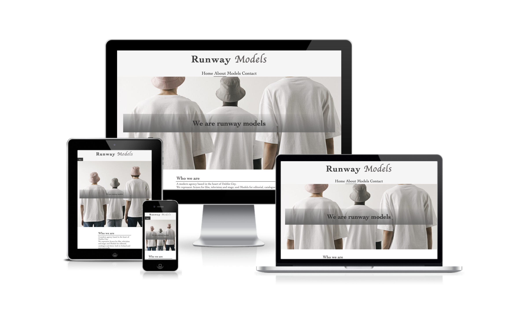
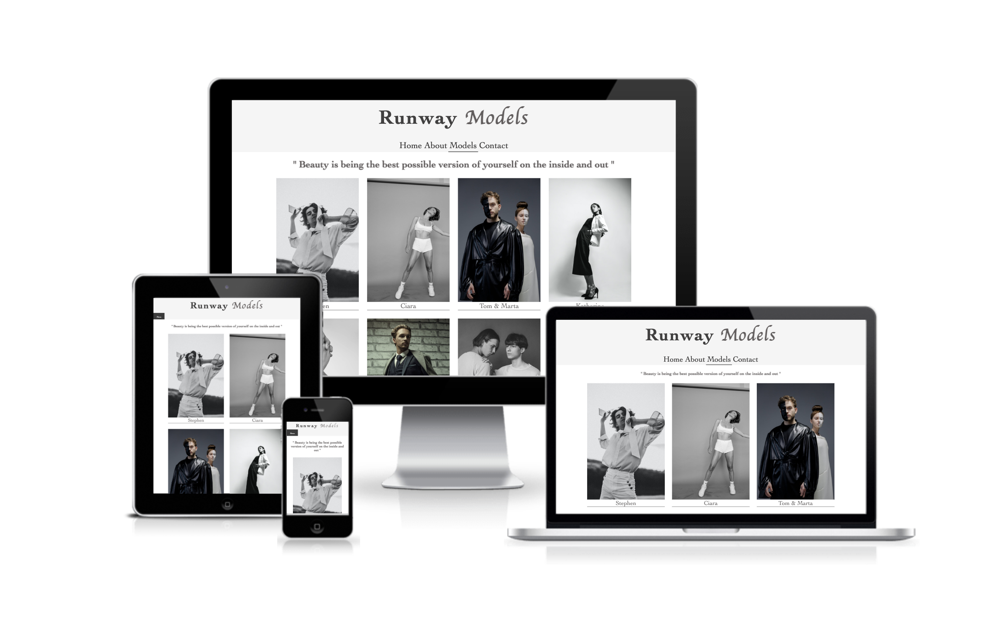
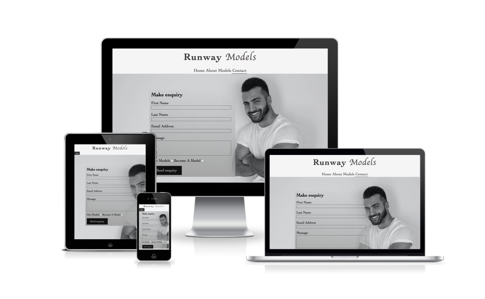

# Runway Models

I have built this Modelling agency website following one of my mo.

# Strategy Plane

- Runway models is intended to be a modelling agency, the goal of the website is to encorage potencial clients and models to interact with this website. This medelling agency apears to be the " Ireland's leading modelling agency, funded in 1973"  as an intent of gaining trush from its users at first sight. this wedsite's style is minimalist but epealing to the eyes, making it easy to use on any screen size.

# Wedsite goals

- Provide the user with an opportunity to cultivate a new career.
- Provide an easy undestanding of what the this wedsite is about.
- Ensure an easy navigation through the site.
- Ensure a pleasant navigation with images that describe the different themes addressed.
- Create a matter of interest and trush amount users
- Attract potensial clients and users to start a new career, making it easy to apply and or to contact.
- Instant insterest by providind artistic image and interaction.

# User Stories

- As a user I want to find a professional description of the topics that give me the desire to hire this company.
- As a user I want to have the chance to contact the agency to provide further information about their services or how to become a model.
- As a user I want to have access to the models by looking at the gallery.
- As a user I want to feels inspired.
- As a user I want to become a model
- As a user I want a wedsite that is easy to navigate through.
- As a user I want to have access to the site from different devices.

# Wireframe
## Home page

## About page

## Models page

## Contact page

# Features

## Navigation 

- This wedsite consist in 4 different pages **Home** , **About** , **Models** , **Contact**.
-  I have connected the Logo **"Runway Models"** to  **Home** which can be clicked anywhere in the page.
- Right uder the logo, we can find the navigation bar easy to accesss with a hover effect and a current page indication, making it easy for the user to know in what section of the page they are at, and also it is easy for them to go back **Home** or navigate throught the site.
- When this page is viewed in a device smalller that 950px, I have added a "hover-over" drop down **menu** bar making this site more apealling in smaller screen sizes, and the hover-over effect is provides an easy navigation experience. 
- The **Logo** and **navigation** bar links help the user navigate accross the site's pages with simple, readable and direct names.

## The Header
- The header shows a h2 headder indicating what this site is about and the main location of the company with a background image displaying an artistic side view of a man wearing a hat, making it misterious yet, interesting to navigate throught.
- The header has a zoom effect with the page is visited.
- The header as well as the entire wedsite uses the colors: black, white and gray to avoid distraction and maintain consistency.

## First section of the page 
- The first section shows the hero image on the right side in a smaller size. 
- On the left side hero text is shown give a quick description of the this page in about and what the company does.

## footer 
- The footer shows links for the social networks in the center.
- The footes maintains the same hover effect as the navigation bar for consistency.
- The links are in the for of Icons of each relevant link as well as the name of the link.
- The links contain a hoover effect feature that when hoover over this links change color to the relevant links **Blue** for Twitter , **Red** for Youtube , **Yellow** for Instagram and **Aqua** for Facebook.

