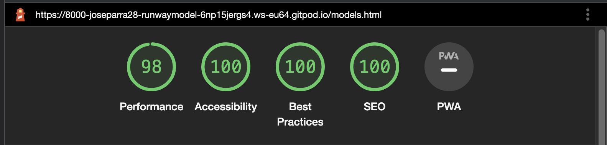

# Runway Models

I have built this Modelling agency website following one of my mother passions. I have created this site to allow users to interact with this site in a smooth and easy way. Images and colors were carefully choosen to maintain a concistent style across the entire page. My goals is to make this wedsite  merorable for anyone who enters this site.

# Strategy Plane

- Runway models is intended to be a modelling agency, the goal of the website is to encorage potencial clients and models to interact with this website. This medelling agency apears to be the " Ireland's leading modelling agency, funded in 1973"  as an intent of gaining trush from its users at first sight. this wedsite's style is minimalist but epealing to the eyes, making it easy to use on any screen size.

# Wedsite goals

- Provide the user with an opportunity to cultivate a new career.
- Provide an easy undestanding of what the this wedsite is about.
- Ensure an easy navigation through the site.
- Ensure a pleasant navigation with images that describe the different themes addressed.
- Create a matter of interest and trush amount users
- Attract potensial clients and users to start a new career, making it easy to apply and or to contact.
- Instant insterest by providind artistic image and interactions.

# Who's this wedsite for
- Any one  who has an interest on becoming a model. 
- Fashion designers , photographers or any company that requieres the sevices of a model. 
- Users of all ages

# User Stories

- As a user I want to find a professional description of the topics that give me the desire to hire this company.
- As a user I want to have the chance to contact the agency to provide further information about their services or how to become a model.
- As a user I want to have access to the models by looking at the gallery.
- As a user I want to feels inspired.
- As a user I want to become a model
- As a user I want a wedsite that is easy to navigate through.
- As a user I want to have access to the site from different devices.
- As a user I want to interact with this wedsite, and submit a quiriy

# Wireframe
## **The over all design of this wedsite is mean to be minimalistic yet appealing to the eyes, my goal was to create a site that is responsive and intuitive making it easy to navigate.**
## Home page

## About page

## Models page

## Contact page

# Features

## Navigation 

- This wedsite consist in 4 different pages **Home** , **About** , **Models** , **Contact**.
-  I have connected the Logo **"Runway Models"** to  **Home** which can be clicked anywhere in the page.
- Right under the logo, we can find the navigation bar easy to accesss with a hover effect and a current page indication, making it easy for the user to know in what section of the page they are at, and also it is easy for them to go back **Home** or navigate throught the site.
- When this page is viewed in a device smaller that 950px, I have added a "hover-over" drop down **Menu bar**  making this site more apealling and organized in smaller screen sizes, and the hover-over effect is provides an easy navigation experience. 
- The **Logo** and **navigation** bar links help the user navigate accross the site's pages with simple, readable and direct names.
- The **Logo** and **navigation** bar links are coahesive across all pages.

## The Header - Home page
- The header shows a h2 headder indicating what this site is about and the main location of the company with a background image displaying an artistic side view of a man wearing a hat, making it misterious yet, interesting to navigate throught.
- The header has a zoom effect that activates when the page is visited.
- The header as well as the entire wedsite uses the colors: black, white and gray to avoid distraction and maintain consistency.

## First section of home page
- The first section shows the hero image on the right side in a smaller size. 
- On the left side hero text is shown give a quick description of the this page in about and what the company does.

## footer 
- The footer shows links for the social networks in the center.
- The footer maintains the same hover effect as the navigation bar for consistency.
- The links are in the for of Icons of each relevant link as well as the name of the link.
- The links contain a hoover effect feature that when hoover over this links change color to the relevant links **Blue** for Twitter , **Red** for Youtube , **Yellow** for Instagram and **Aqua** for Facebook.

## The Header - About page
- The **About** page shows a h2 headder indicating what this current site is about with a background image displaying three guys wearing white t-shirts, making it misterious yet, appealing to the eye . I have choosen this image to avoid distraction from the main text. 
- The header has a zoom effect with the page is visited.

## First section of About page

- In this section there are 4 different texts clearly indicating important information of what this company is about, what they do, their story, their location and an ivitation to become a model.
- It has a **Become a model** link that changes its color when hover over to indicate that this text is clickable, when clicked it will bring the user to the **Make Enquiry** page.

## First section of Models page
- In this section I have included a motivational text with a zoon effect.
- The models gallery is displaied right under the motivational text, the galery includes the models names, I have carefully selected each image to maintain the wedsite's style. 
- Each image has an individual zoom effect that when hover over (or clicked on touchscreen devices) it will increase the size of the image with a smooth transition.
- This image gallery displays different colum counts depending on the device size that is being viewed.

## First section of Contact page
- This section contains a **Form** with a *Make enquiry* h2 allowing the user to contact the company about Our models or Become a model, I have also icluded a text so the user can write down any quiry they may have.
- The background image invites the user to make an enquiry.
- This form contains required fiels, so the user can not submit the for with out filling the fiels wuth the right text.
- I have included a hover over the **Submit** buttom. 
- this for has a zoom animation when visited to maintain the style across the entire wedsite

## Second section of Contact page
- In this section I have included a **Contact us** text, indicating business addrees, email address, and phone number.
- Thiis section contains a map indicatiin how to find the business.
- The table displays important information such as **Opening times**

# Testing
- I tested that this pages work in different browswers: Firefox, Chrome and Safari.
- I confirmed that this project is responsive, looks good and functions on all standard screen sizes using the devtools device toolbar.
- I have tested the **Make enquiry** form in the contact page and they all work by accepting only email in the email field, with a submit button that work as expected. 

# Validator Testing

## HTML
- No errors were returned when passing through the official W3C validator.
## CSS
- No errors were found when passing through the official (Jigsaw) validator.

# Accessibility
- I confirm that after passing through the Lighthouse in devtool the font choose is clearly readable.
# Performance
## Home page
 

## About page
 

## Models page
 

## Contact page

# Bugs
- No bugs were found during this project

# Deployment
- The site was deployed to GitHub pages. The steps to deploy are as follows:
- In the GitHub repository, navigate to the Settings tab
- From the source section drop-down menu, select the Pages
- Once the Pages has been selected, the page will be automatically refreshed with a detailed ribbon display to indicate the successful deployment.
## Link
- The live link can be found here https://8000-joseparra28-runwaymodel-6np15jergs4.ws-eu64.gitpod.io/index.html

# Credits
## Content

- The code for social media links was inspired from the CI Love Running Project.
- Social media icons were take from Font-awsome
- Font familly was taken from Google fonts
- The code for form action in contact us page was taken from the CI Love Running Project.
- Drop down menu bar for inspired by Slider Revolution (https://www.sliderrevolution.com/resources/css-dropdown-menu/)
- Image hover code was instired by Wed zone (https://www.youtube.com/watch?v=Zz8A4NqoLrE&t=61s)
- 
- 

# Media
- All images were taken from Pexels.

# Reference Material
- Used W3School for deepen some topic for site improving such as shadowing of boxes, flexbox attribute and for have further knowledge about what I have studied with Code Institute during the site development.
# Acknowledgements
- I would like to thank my mentor Jubril Akolade who providel mentoring during the development of this project giving me valuable advice on how improve the site from start to finish.

